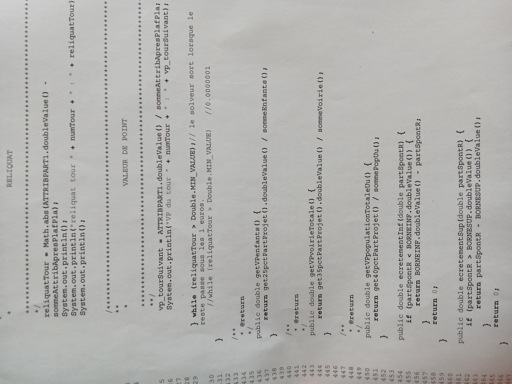
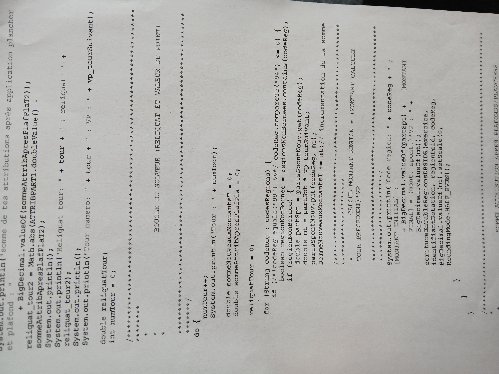

# Solveur de Répartition Budgétaire entre Collectivités

Ce projet présente un extrait d’un algorithme de répartition budgétaire, développé dans un contexte réel, à partir de données publiques. 

> ⚠️ Ce code a été conçu et implémenté par moi-même (sans chatGpt!) dans un cadre professionnel,   
> en s'appuyant uniquement sur des **règles de calcul publiques**.   
> Il ne contient aucune donnée confidentielle, sensible ou propriétaire, 
et sa publication a été autorisée à titre personnel dans un objectif de valorisation de compétences. 
Elle s’inscrit dans un cadre clair et vise à illustrer une logique métier réellement appliquée. 

---

## 🧠 Objectif du code

Ce code permet de répartir un **montant budgétaire global** entre plusieurs collectivités (ex : régions ou communes), en appliquant : 

- Des **bornes minimales (plancher)** et maximales (**plafond**) d’attribution 
- Un **calcul de “valeur de point” (VP)** pour lisser la distribution 
- Une **réattribution itérative du reliquat** (l’écart restant) jusqu’à convergence 

---

## 🔁 Comment ça marche (expliqué simplement)

1. À chaque tour, le code calcule un nouveau **montant attribué** à chaque collectivité.
2. Il applique les règles de **plancher et plafond**.
3. Il ajuste la **valeur de point (VP)** en fonction du reliquat restant.
4. Il recommence **jusqu’à ce que le reliquat soit inférieur à 0,000001** (convergence).
5. Il écrit les résultats dans une base et les affiche à l’écran.

---

## 📸 Extraits du code (Java)

